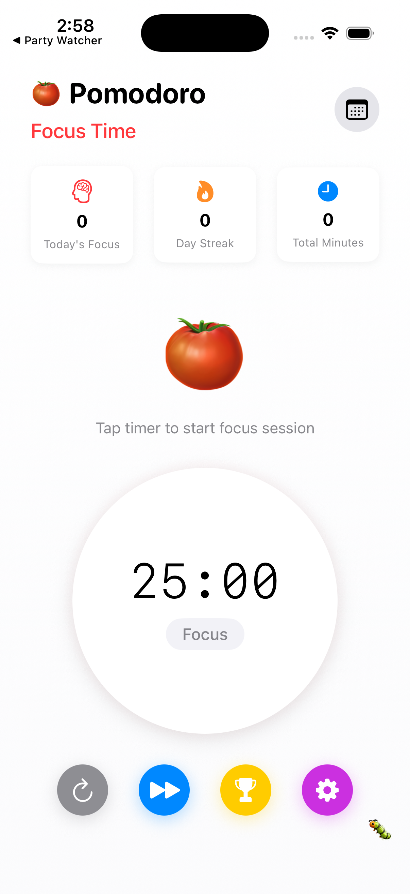
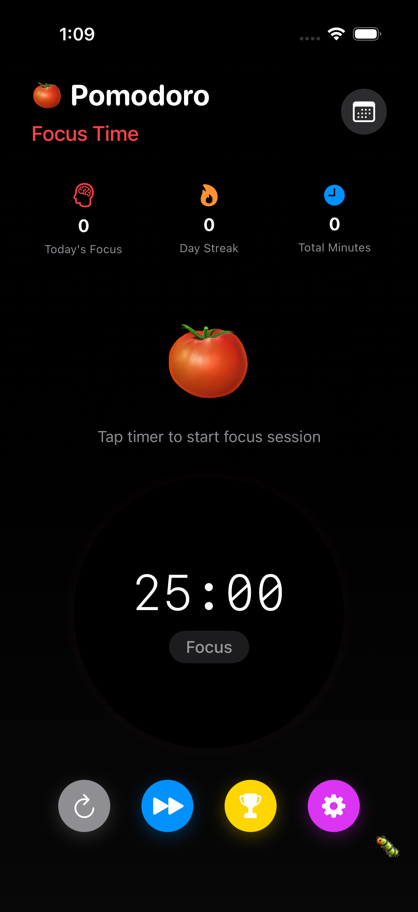
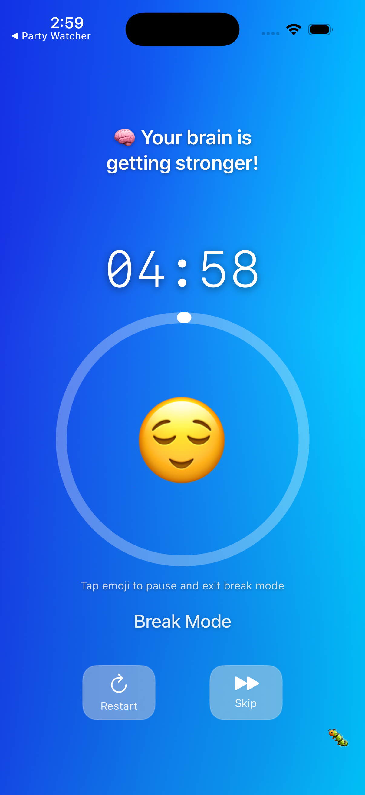
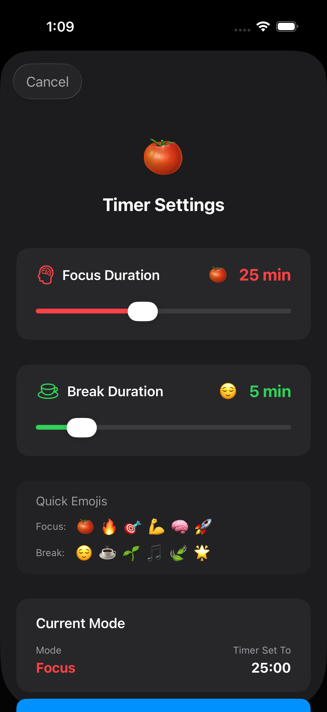
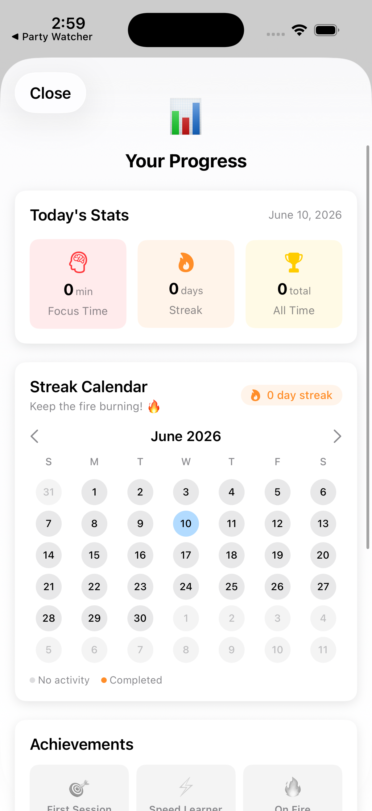
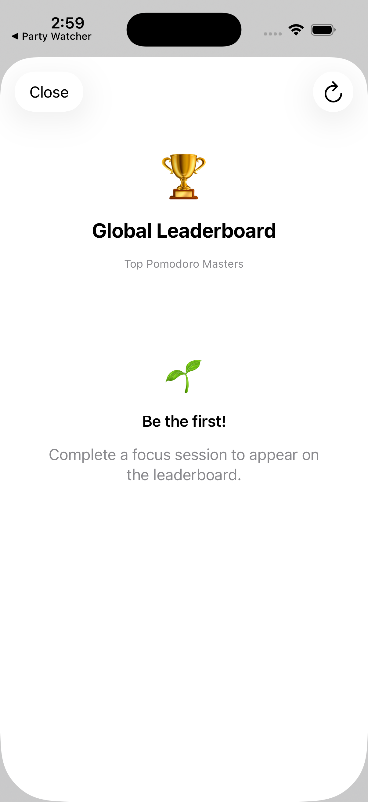
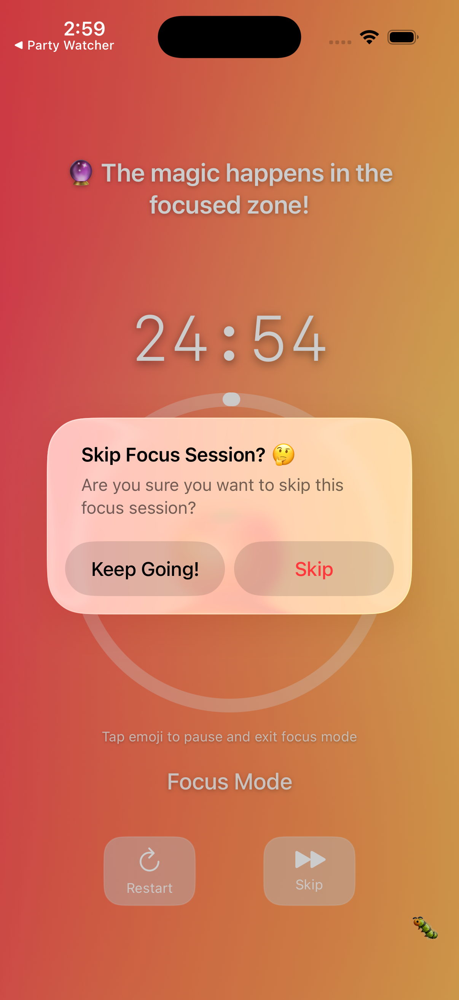

# Pomodoro Timer

**Focus, one tomato at a time.** 🍅

A polished Pomodoro focus-timer for iOS. Run customizable focus and break sessions, stay accountable with a focus-mode lock, track your productivity over time, and compete on a global leaderboard. Built with SwiftUI and Firebase.

[](https://github.com/billdmar/PomodoroTimer/actions/workflows/ci.yml)


---

## Features

- **Focus & break sessions** — 25-minute focus and 5-minute break sessions by default, each fully customizable (1–60 min focus, 1–30 min break).
- **Animated progress ring** — A visual progress circle and color-coded modes (red for focus, green for break) make your session state obvious at a glance.
- **Focus-mode lock** — Locks you into a session to discourage task-switching, with reset and skip controls.
- **Interactive tomato button** — Shake animation and star-particle bursts for a bit of delight.
- **Stats** — Track sessions completed and time focused over time.
- **Global leaderboard** — Compete with other users, backed by Firebase Cloud Firestore.

## Tech stack

| Area | Technology |
| --- | --- |
| UI | SwiftUI (iOS 18.5+) |
| Language | Swift 5 |
| Architecture | MVVM with `ObservableObject` |
| Backend | Firebase Cloud Firestore (leaderboard) |
| Timer | Foundation `Timer` |

## Screenshots

| Home | Focus session | Break |
| :--: | :--: | :--: |
|  |  |  |

| Settings | Progress & streak | Leaderboard |
| :--: | :--: | :--: |
|  |  |  |

| Focus-mode lock | | |
| :--: | :--: | :--: |
|  | | |

## Project structure

```
pomadoro2/
├── pomadoro2App.swift       # App entry point
├── ContentView.swift        # Main timer screen and controls
├── TimerManager.swift       # Timer logic and session state
├── TimerMath.swift          # Pure timer helpers (formatting, progress) — unit-tested
├── StreakCalculator.swift   # Pure streak math — unit-tested
├── AppLockManager.swift     # Focus-mode locking
├── Logging.swift            # Debug logging that compiles out of Release builds
├── TomatoButton.swift       # Interactive tomato button + animations
├── StarParticlesView.swift  # Particle-effect celebrations
├── SettingsView.swift       # Duration customization
├── StatsView.swift          # Productivity stats and streak calendar
├── LeaderboardView.swift    # Global leaderboard UI
└── FirebaseManager.swift    # Firestore integration

pomadoro2Tests/              # Swift Testing unit tests (timer + streak logic)
pomadoro2UITests/            # XCUITest smoke tests
firestore.rules              # Least-privilege Firestore security rules
.github/workflows/ci.yml     # Build + test on every push / PR
```

## Getting started

1. Open `pomadoro2.xcodeproj` in Xcode.
2. The project uses Firebase for the leaderboard. To run with your own backend, create a Firebase project and replace `pomadoro2/GoogleService-Info.plist` with your own config.
3. Build and run on a simulator or device.

> The bundled `GoogleService-Info.plist` holds Firebase **client** configuration, which Google designs to ship inside apps — access is controlled by Firestore security rules, not by keeping this file secret.

## Testing

```bash
xcodebuild test \
  -project pomadoro2.xcodeproj \
  -scheme pomadoro2 \
  -sdk iphonesimulator \
  -destination 'platform=iOS Simulator,name=iPhone 16 Pro' \
  CODE_SIGNING_ALLOWED=NO
```

- **Unit tests** ([`pomadoro2Tests`](pomadoro2Tests)) cover the pure timer and streak logic in `TimerMath` and `StreakCalculator` using the [Swift Testing](https://developer.apple.com/documentation/testing) framework — time formatting, progress, and streak transitions (same-day, consecutive day, and multi-day-gap reset).
- **UI smoke tests** ([`pomadoro2UITests`](pomadoro2UITests)) verify the app launches to the timer screen and that starting a session shows the running timer.
- Every push and pull request runs the full suite on an iOS Simulator via [GitHub Actions](.github/workflows/ci.yml).

## Backend security

The leaderboard runs on Firebase Cloud Firestore. The repository ships [`firestore.rules`](firestore.rules), which enforces least privilege:

- `userStats/{uid}` is **publicly readable** (so any client can render the leaderboard) but **writable only by the authenticated owner**, with field/type validation on the numeric stats.
- `focusSessions` is **append-only** for the authenticated owner — no client reads, edits, or deletes.

Deploy the rules with:

```bash
firebase deploy --only firestore:rules
```

For defense in depth, also add an [API-key application restriction](https://cloud.google.com/docs/authentication/api-keys#api_key_restrictions) in the Google Cloud console, limiting the iOS key to the app's bundle identifier (`dh.pomadoro2`).

## About the Pomodoro Technique

The Pomodoro Technique, developed by Francesco Cirillo in the late 1980s, breaks work into focused intervals (traditionally 25 minutes) separated by short breaks — improving focus, reducing fatigue, and making time management more sustainable.

## License

[MIT](LICENSE) © William Mar
